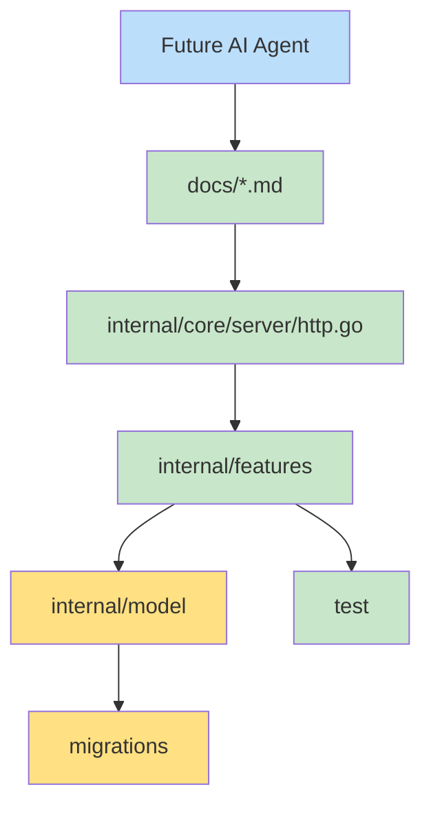

# AI Context

## Project Summary

Bytecode API is a Go Fiber REST API for identity and access management. It includes auth, users, roles, permissions, JWT access tokens, refresh-token rotation, optional Redis caching, optional local/MinIO storage, and background jobs.

## Architecture Summary

- Entrypoints: `cmd/api/main.go` and `cmd/worker/main.go`.
- HTTP server and dependency wiring: `internal/core/server/http.go`.
- Feature modules: `internal/features/auth`, `user`, `role`, `permission`.
- Persistence: PostgreSQL through GORM repositories.
- Schema: SQL migrations under `migrations/`.
- Shared API envelope: `internal/shared/response`.

## Coding Conventions

- Keep transport code in `handler`.
- Keep business logic in `service`.
- Keep GORM code in `repository`.
- Keep interfaces and DTOs in `domain`.
- Use `context.Context` through service and repository calls.
- Use `apperrors.NewAppError` or `apperrors.WrapError` for expected failures.

## Folder Responsibilities

| Folder | Responsibility |
| --- | --- |
| `cmd/api` | API bootstrap and graceful shutdown |
| `cmd/worker` | Scheduled job bootstrap and graceful shutdown |
| `internal/core` | Infrastructure and server composition |
| `internal/features` | Feature modules |
| `internal/model` | Database models |
| `internal/shared` | Shared response, validation, pagination, errors |
| `pkg` | Generic helpers used by internal packages |
| `test` | Unit and integration tests |

## Dependency Rules

- Handlers may import Fiber.
- Domain packages should not import Fiber or GORM.
- Repositories may import GORM and models.
- Services should depend on domain repository interfaces.
- Route registration owns middleware attachment.

## Business Rules

- Registration requires default role `user`.
- `superadmin` bypasses permission checks.
- Users cannot delete themselves.
- Inactive users cannot log in.
- Refresh tokens rotate and old tokens are revoked.
- Permission and role names must be unique.

## Naming Rules

- Permission names use dotted resource-action format.
- Routes use plural resources: `/users`, `/roles`, `/permissions`.
- Cache keys start with feature prefixes: `users:`, `roles:`, `permissions:`.

## Important Services

- `authService`: registration, login, refresh, logout, token cleanup.
- `userService`: user CRUD, profile update, user permissions.
- `roleService`: role CRUD and permission assignment.
- `permissionService`: permission CRUD.

## Critical Flows

- Login: user lookup, bcrypt check, active check, JWT generation, refresh token insert.
- Refresh: hash lookup, revoked/expired check, revoke old token, issue new tokens.
- RBAC: JWT role name, optional superadmin bypass, permission lookup, route decision.
- User mutation: validate uniqueness, hash password when needed, invalidate user cache.

## Common Pitfalls

- Do not use GORM `AutoMigrate`; add SQL migrations.
- Do not add protected routes without `JWTAuth` and appropriate permission middleware.
- Do not store raw refresh tokens.
- Do not assume Redis exists; cache client may be disabled.
- Do not assume profile pictures are uploaded by this API; current endpoints store keys only.
- Be careful with `sort` query handling; current implementation passes it into GORM order text.

## Extension Guidelines

- Add a new feature under `internal/features/<name>` with `domain`, `handler`, `service`, and `repository`.
- Register dependencies in `server.SetupRoutes`.
- Add migrations for tables and indexes.
- Add Swagger annotations to handlers.
- Add integration tests for API behavior and unit tests for service rules.

## Files That Should Rarely Be Modified

- Generated Swagger files: `docs/docs.go`, `docs/swagger.json`, `docs/swagger.yaml`.
- Existing migrations after they have been applied in shared environments.
- `pkg/jwt` unless token semantics change intentionally.

## Recommended Reading Order

1. [README.md](README.md)
2. [ARCHITECTURE.md](ARCHITECTURE.md)
3. [API_SPECIFICATION.md](API_SPECIFICATION.md)
4. [DATABASE.md](DATABASE.md)
5. [AUTHENTICATION.md](AUTHENTICATION.md)
6. [AUTHORIZATION.md](AUTHORIZATION.md)
7. [REQUEST_LIFECYCLE.md](REQUEST_LIFECYCLE.md)

## AI Safety Rules

- Describe only implemented behavior.
- Use "Not present in the analyzed codebase." when a capability is absent.
- Preserve existing layer boundaries.
- Prefer repository-local patterns over new abstractions.
- Update docs when changing routes, config, database schema, auth, cache, storage, or workers.

## Context Map

