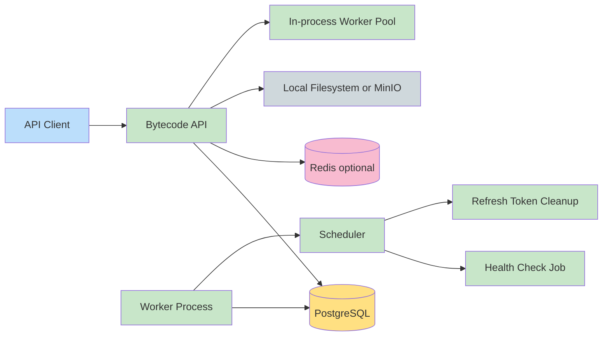
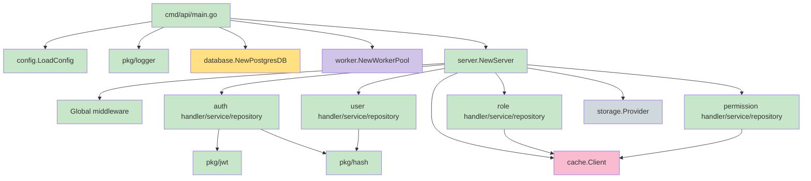
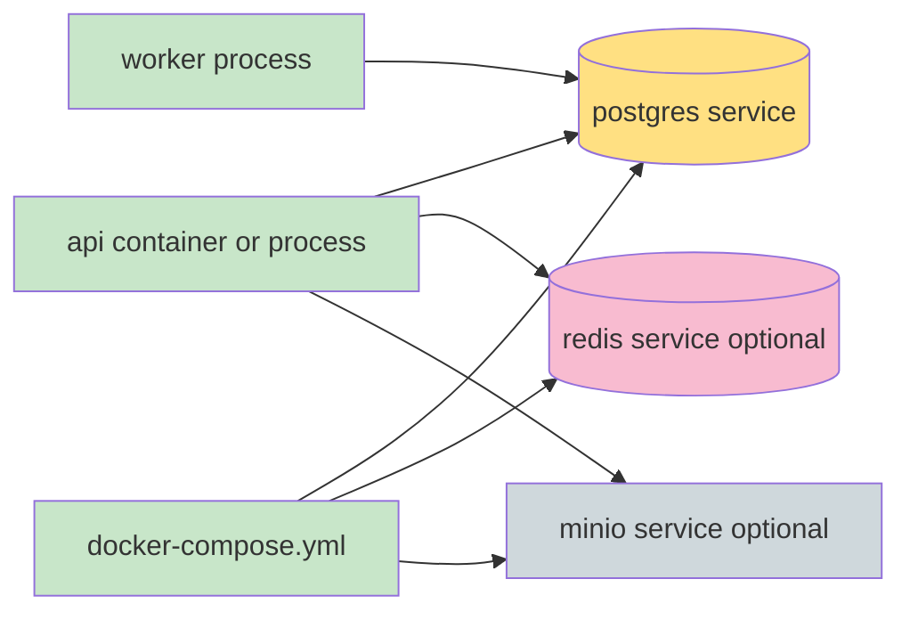
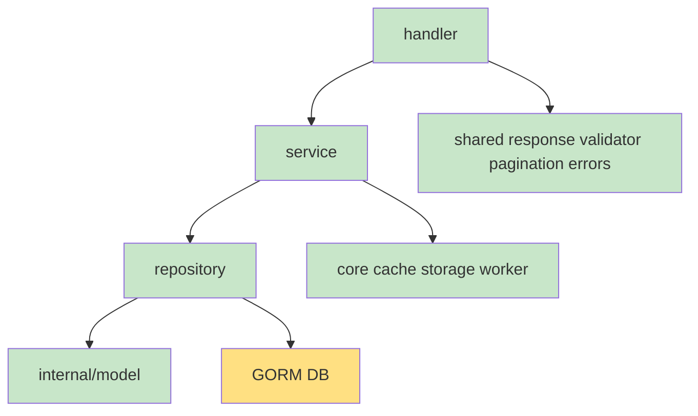

# Architecture

## System Context

## Component Diagram

## Container Diagram

## Module Diagram

## Dependency Graph

- `cmd/api` depends on `internal/core/*`, generated `docs`, and `pkg/logger`.
- `internal/core/server` manually constructs repositories, services, handlers, cache, and storage.
- Feature handlers import Fiber and feature domain interfaces.
- Feature services import domain interfaces, shared errors, and infrastructure interfaces where needed.
- Feature repositories import GORM and `internal/model`.
- Domain packages define DTOs and interfaces. They do not import Fiber.

## Design Patterns

| Pattern | Evidence |
| --- | --- |
| Feature modules | `internal/features/auth`, `user`, `role`, `permission` |
| Repository pattern | `domain.*Repository` interfaces and GORM implementations |
| Service layer | `domain.*Service` interfaces implemented under `service/` |
| Manual dependency injection | `server.SetupRoutes` constructs dependencies explicitly |
| Standard response envelope | `internal/shared/response` |
| Middleware pipeline | Fiber middleware for recovery, CORS, logging, JWT, RBAC |
| Worker pool | `internal/core/worker/pool.go` |
| Scheduler | `internal/core/worker/scheduler.go` |

## Architectural Decisions

- Database schema is migration-first. `AutoMigrate` is intentionally not used.
- The API and scheduled worker are separate executables.
- JWT access tokens carry `user_id`, `email`, and `role_name`.
- Refresh tokens are opaque random values stored only as SHA-256 hashes.
- Redis is optional; disabled mode uses a no-op cache client.
- Storage is selected at runtime by `STORAGE_PROVIDER`.

## Communication Protocols

- HTTP JSON API under `/api/v1`.
- PostgreSQL wire protocol through GORM.
- Redis protocol through `redis/go-redis` when enabled.
- MinIO S3-compatible API when `STORAGE_PROVIDER=minio`.

## Synchronization Strategy

- Worker pool uses a buffered Go channel and goroutines.
- Scheduler uses `time.Ticker`, context cancellation, and `sync.WaitGroup`.
- RBAC middleware uses an in-memory `sync.Map` for role permission cache.
- Service caches are invalidated by Redis key prefixes.

## Data Ownership

| Data | Owner |
| --- | --- |
| Users | User and Auth features |
| Roles | Role feature |
| Permissions | Permission feature |
| Role assignments | Role feature through `role_permissions` |
| Refresh tokens | Auth feature |
| Profile picture references | User feature |

## Cross-Cutting Concerns

- Logging: Zap request logs and job logs.
- Error handling: `AppError` plus Fiber `ErrorHandler`.
- Validation: `go-playground/validator`.
- Security: JWT authentication, RBAC authorization, bcrypt hashing.
- Caching: Redis/no-op abstraction and middleware in-memory cache.
