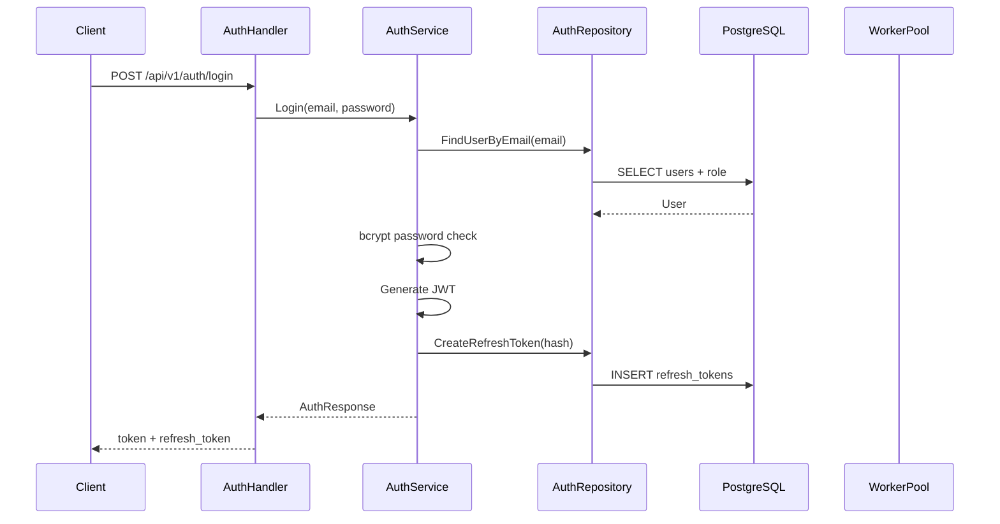
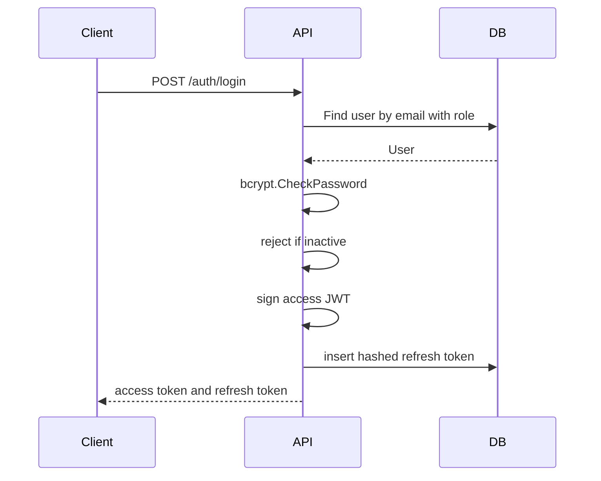
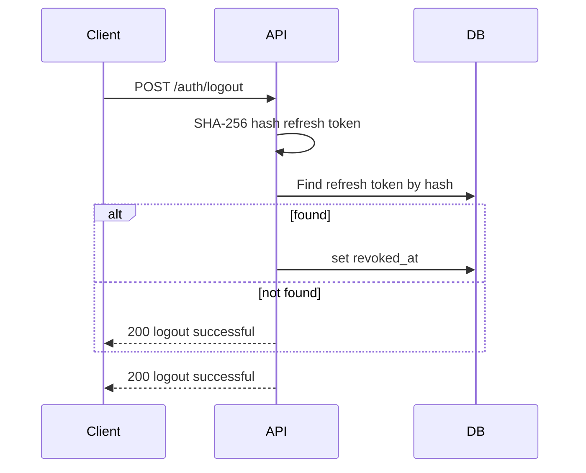

# Authentication

## Authentication Flow

The API uses email/password authentication, JWT access tokens, and opaque refresh tokens.

## JWT

Access tokens are generated in `pkg/jwt`.

| Attribute | Value |
| --- | --- |
| Signing method | HMAC SHA-256 |
| Secret | `JWT_SECRET` |
| Claims | `user_id`, `email`, `role_name`, `iat`, `exp` |
| Expiry | `JWT_EXPIRY_HOURS`, default `24` |

The parser rejects unexpected signing methods.

## OAuth

Not present in the analyzed codebase.

## Session

Server-side web sessions are not present in the analyzed codebase.

## Refresh Token

Refresh tokens are random 32-byte values encoded as hex. Only SHA-256 hashes are stored in `refresh_tokens.token_hash`.

## Token Lifetime

| Token | Configuration | Default |
| --- | --- | --- |
| Access token | `JWT_EXPIRY_HOURS` | `24` hours |
| Refresh token | `JWT_REFRESH_EXPIRY_HOURS` | `168` hours |

## Middleware

`middleware.JWTAuth` reads the `Authorization` header, requires `Bearer <token>`, parses the token, and stores claims in `c.Locals("user")`.

## Login Sequence

## Logout Sequence

