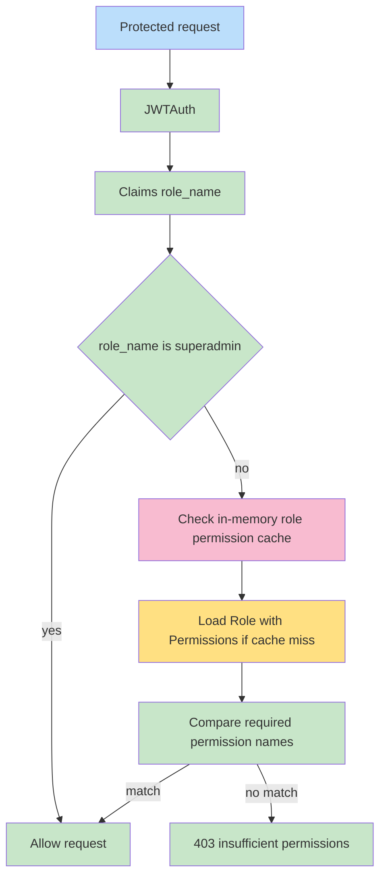

# Authorization

## RBAC

Role-based access control is implemented with:

- `roles`
- `permissions`
- `role_permissions`
- `middleware.RequirePermission`
- JWT `role_name` claim

The middleware reads the authenticated user's role name from JWT claims, loads permissions for that role, and checks whether at least one required permission exists.

## ABAC

Not present in the analyzed codebase.

## Policies

No standalone policy objects or policy engine are present. Authorization rules are attached directly in route registration files.

## Permissions

Seeded permission names:

- `roles.view`
- `roles.create`
- `roles.edit`
- `roles.delete`
- `roles.assign-permission`
- `roles.remove-permission`
- `permissions.view`
- `permissions.create`
- `permissions.edit`
- `permissions.delete`
- `users.view`
- `users.create`
- `users.edit`
- `users.delete`

## Guards

`guard_name` exists on roles and permissions, defaulting to `api`. The analyzed authorization middleware does not filter by `guard_name`.

## Middleware

| Middleware | Responsibility |
| --- | --- |
| `JWTAuth` | Validates Bearer JWT and stores claims |
| `RequirePermission` | Checks permission names for the user's role |
| `RequireRole` | Checks role names; defined but not used by current routes |

## Role Hierarchy

There is no persisted hierarchy. `superadmin` has a hard-coded bypass in `RequirePermission`.

## Permission Resolution

