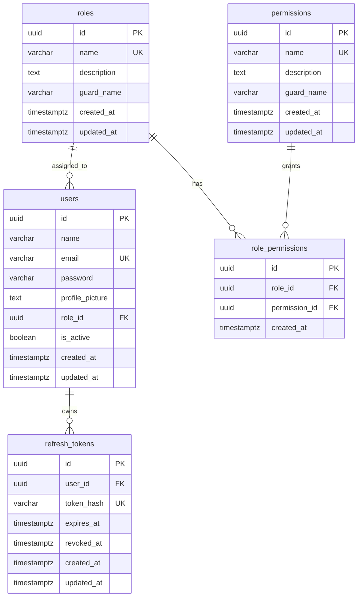

# Database

## Database Engine

PostgreSQL is the only implemented database engine. The application connects through GORM using `gorm.io/driver/postgres`.

## Schema

| Table | Purpose |
| --- | --- |
| `roles` | Role definitions such as `superadmin`, `admin`, and `user` |
| `permissions` | Permission names such as `users.view` |
| `users` | User accounts and role assignment |
| `role_permissions` | Many-to-many role permission join table |
| `refresh_tokens` | Hashed opaque refresh tokens |

## Relationships



## Indexes

| Table | Index |
| --- | --- |
| `roles` | unique `name` |
| `permissions` | unique `name` |
| `users` | unique `email` |
| `role_permissions` | unique `(role_id, permission_id)` |
| `refresh_tokens` | unique `token_hash` |
| `refresh_tokens` | `idx_refresh_tokens_user_id` |
| `refresh_tokens` | `idx_refresh_tokens_expires_at` |

## Constraints

- Primary keys use UUID with `gen_random_uuid()`.
- `users.role_id` references `roles(id)` with `ON DELETE SET NULL`.
- `role_permissions.role_id` references `roles(id)` with `ON DELETE CASCADE`.
- `role_permissions.permission_id` references `permissions(id)` with `ON DELETE CASCADE`.
- `refresh_tokens.user_id` references `users(id)` with `ON DELETE CASCADE`.

## Migration Strategy

Migrations live under `migrations/` as Go files containing `gormigrate.Migration` values. Each migration defines `Migrate` and `Rollback` functions, uses migration-local GORM models, and registers itself in version order.

```bash
make migrate-up
make migrate-down
make migrate-refresh
make migrate-create name=create_something_table
```

GORM migrator functions such as `AutoMigrate`, `AddColumn`, and `DropTable` are used only inside versioned migrations. The API and worker do not migrate the schema automatically during startup.

Gormigrate records applied IDs in `gormigrate_migrations`. On the first run against a database previously managed by `golang-migrate`, the migration command imports the clean version from `schema_migrations` so already-applied migrations are not replayed. A dirty legacy version must be repaired before the switch.

## Seed Data

Migration `000005` inserts roles:

- `superadmin`
- `admin`
- `user`

Migration `000006` inserts permissions and assigns all permissions to `superadmin`.

## Soft Deletes

Not present in the analyzed codebase. Models do not include `gorm.DeletedAt`, and deletes execute hard deletes.

## Transactions

Gormigrate executes migration and rollback operations in transactions.

## Isolation

No custom transaction isolation level is configured.
