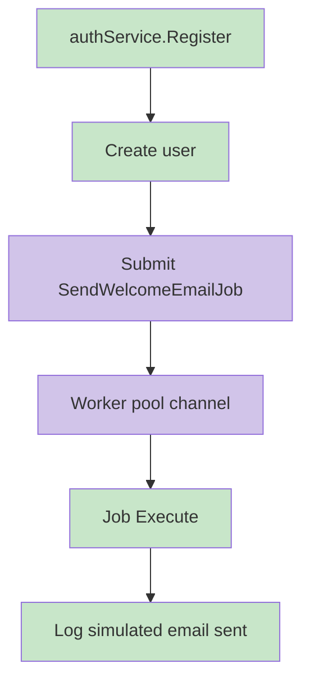

# Events

## Domain Events

Not present in the analyzed codebase.

## Application Events

No event bus abstraction exists. The closest implemented asynchronous action is direct submission of a welcome-email job after user registration.

## Event Bus

Not present in the analyzed codebase.

## Subscribers

Not present in the analyzed codebase.

## Publishers

Not present as event publishers. `authService.Register` directly calls `workerPool.Submit`.

## Flow Diagram

## Messaging

External messaging systems such as Kafka, RabbitMQ, NATS, or SQS are not present in the analyzed codebase.
