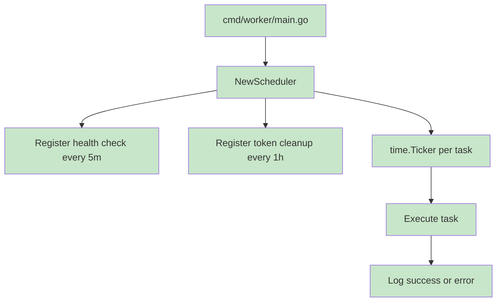

# Queues

## Jobs

| Job | Location | Execution Mode |
| --- | --- | --- |
| `SendWelcomeEmailJob` | `internal/features/auth/job/send_email_job.go` | API process worker pool |
| `system_health_check` | `internal/core/worker/jobs/health_check.go` | Worker process scheduler every 5 minutes |
| `cleanup_expired_tokens` | `cmd/worker/main.go` through `AuthService.CleanupExpiredTokens` | Worker process scheduler every 1 hour |
| `CleanupExpiredTokensJob` | `internal/features/auth/job/cleanup_token_job.go` | Defined but not registered directly |

## Workers

`WorkerPool` starts a fixed number of goroutines. The API process configures `5` workers and queue size `100`.

## Retries

Not present in the analyzed codebase.

## Dead Letter Queue

Not present in the analyzed codebase.

## Scheduling

The worker process uses `Scheduler` with `time.Ticker`.

## Concurrency

- Worker pool concurrency equals configured worker count.
- Scheduler runs each registered task in its own goroutine.
- Active jobs finish during worker-pool shutdown after the queue is closed.
