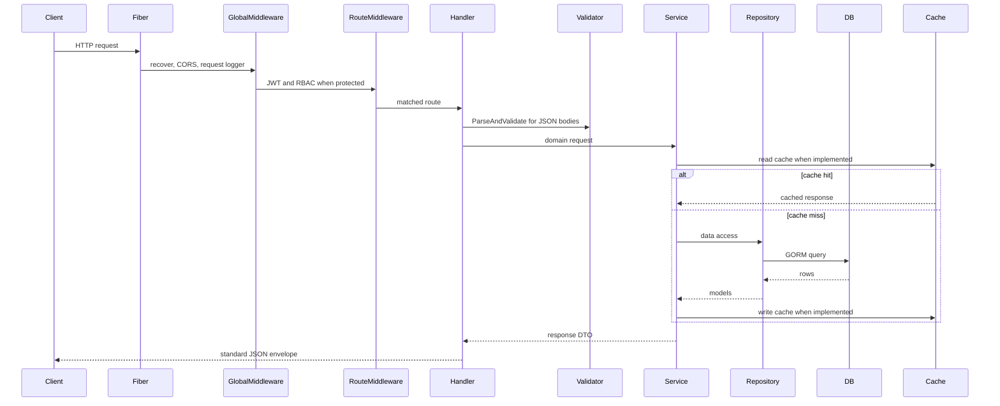

# Request Lifecycle

## HTTP Request Flow

## Router

`server.SetupRoutes` creates `/api/v1` and registers feature routes.

## Middleware

Global middleware:

- Fiber recover middleware.
- CORS middleware with default config.
- Structured request logger.

Protected group middleware:

- JWT middleware.
- Permission middleware for admin routes.

## Validation

Handlers use `validator.ParseAndValidate[T]` for JSON body parsing and struct-tag validation.

## Controller

The codebase calls HTTP controllers `handlers`. Handlers are the only feature layer that imports Fiber.

## Service

Services hold business rules and interact with repositories, cache, storage URL generation, hashing, JWT generation, and worker jobs.

## Repository

Repositories use GORM with request contexts through `db.WithContext(ctx)`.

## Database

PostgreSQL is reached through GORM. Connection pooling is configured in `database.NewPostgresDB`.

## Response

All handlers return the shared response envelope from `internal/shared/response`.
